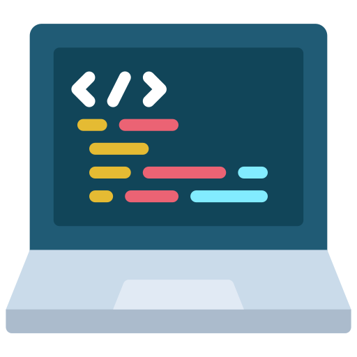

<div align="center" id="top"> 
  

  &#xa0;
</div>

<h1 align="center">Competitive programming problems</h1>

<p align="center">
  

  

  

  

  
</p>

<!-- Status -->
 <h4 align="center"> 
	🚧  🚀 Under construction...  🚧
</h4> 

<hr> 

<p align="center">
  <a href="#dart-about">About</a> &#xa0; | &#xa0; 
  <a href="#rocket-technologies">Technologies</a> &#xa0; | &#xa0;
  <a href="#white_check_mark-requirements">Requirements</a> &#xa0; | &#xa0;
  <a href="#checkered_flag-starting">Starting</a> &#xa0; | &#xa0;
  <a href="https://github.com/ViiniciusK9" target="_blank">Author</a>
</p>

<br>

## :dart: About ##

Competitive programming is a mental sport where participants solve well-defined algorithmic problems within a specified period of time. It involves using programming skills to solve complex and diverse computational problems efficiently.

This is a repository that contains several problems solved in online judges such as Codeforces, Beecrowd and others.

## :rocket: Technologies ##

The following tools were used in this project:

- [C++](https://cplusplus.com/)
- [Python](https://www.python.org/)
- [C](https://www.w3schools.com/c/c_intro.php)

## :white_check_mark: Requirements ##

Before starting :checkered_flag:, you need to have [Git](https://git-scm.com)  installed.

## :checkered_flag: Starting ##

```bash
# Clone this project
$ git clone https://github.com/ViiniciusK9/tasks

# Access
$ cd tasks

```


Made with :heart: by <a href="https://github.com/ViiniciusK9" target="_blank">Vinicius Koncicoski</a>

&#xa0;

<a href="#top">Back to top</a>
